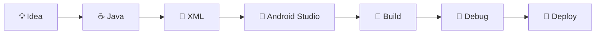

<div align="center">


<br>


<br><br>


<br><br>


</div>

---


# 🤖 Android Command Center

```diff
+ STATUS : ONLINE
+ IDE    : ANDROID STUDIO
+ LANG   : JAVA
+ BUILD  : SUCCESSFUL
+ MODE   : DEVELOPMENT
+ PROJECTS : ACTIVE
```

---

## 📱 About This Repository

Welcome to my Android Development Hub.

This repository contains all the Android applications I build using Android Studio while exploring mobile application development.

From beginner projects to advanced Android applications, every project here represents a step in my learning journey.

### Current Exploration Areas

- 📱 Android Development
- ☕ Java Programming
- 🎨 XML UI Design
- 🔥 Firebase Integration
- 🗄 SQLite Databases
- 🌐 REST API Integration
- 🚀 Mobile Application Development

---


# 📡 Repository Scan

```text
Scanning Android Projects...

███████████████████████████████ 100%

Projects Located      ✓
Source Code Verified  ✓
Gradle Synced         ✓
Build Successful      ✓
Ready For Deployment  ✓
```

---

# 🛰 Project Navigation

```text
📂 Android_Studio_Projects

├── 📱 HelloWorld
├── 🧮 Calculator App
├── 📝 Notes App
├── 🔥 Firebase Projects
├── 🌐 API Projects
├── 🗄 SQLite Projects
├── 🎨 UI Experiments
└── 🚀 More Projects Coming Soon...
```

---

# ⚙ Android Build Pipeline



---

# 🛠 Tech Stack

<div align="center">


</div>

---

# 📈 Development Analytics

```text
Android Studio    ████████████████████░░░ 85%

Java              ██████████████████░░░░░ 80%

XML               █████████████████░░░░░░ 75%

Firebase          ████████████░░░░░░░░░░░ 55%

SQLite            █████████████░░░░░░░░░░ 60%

REST APIs         ██████████░░░░░░░░░░░░░ 50%
```

---

# 🔋 Developer Status

```text
☕ Coffee       ████████████████████ 100%

💻 Coding       ████████████████████ 100%

🐞 Debugging    ████████████████░░░░ 80%

🚀 Learning     ████████████████████ 100%

😴 Sleep        ██░░░░░░░░░░░░░░░░░░ 10%
```

---

# 💻 Terminal Access

```bash
C:\AndroidStudioProjects> initialize

Loading Java Environment...
Loading Android SDK...
Connecting Emulator...
Loading XML Resources...
Syncing Gradle...

STATUS : SUCCESS

Android Development Environment Ready
```

---

# 🤖 Android Core Logic

```java
public class AndroidDeveloper {

    public static void main(String[] args) {

        while (true) {

            learn();

            code();

            build();

            fail();

            debug();

            improve();
        }
    }
}
```

---

# 🎯 Repository Mission

```text
✓ Learn Android Development

✓ Build Real-World Applications

✓ Improve Problem Solving

✓ Explore Mobile Technologies

✓ Create Better User Experiences

✓ Become a Professional Android Developer
```

---

# 🌌 Android Ecosystem

<div align="center">


</div>

---


<div align="center">

# 🟢 SYSTEM READY

### Android Studio Projects Repository

### Building • Learning • Innovating

<br>


</div>
